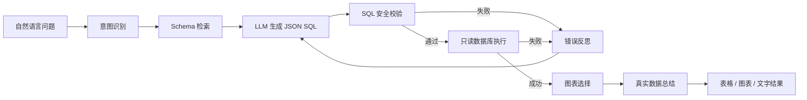

# 智能数据分析 Agent（Text2SQL）

这是一个面向真实业务问答场景的 Text2SQL 智能数据分析系统。用户可以使用自然语言提问，系统会完成意图识别、Schema 检索、SQL 生成、安全校验、只读执行、错误反思重试、图表选择和结果总结。

示例问题：

- 最近 7 天每天新增用户数是多少
- 上个月销售额最高的前 10 个产品是什么
- 各订单状态的订单数量占比是多少
- 各销售渠道的销售额分布如何
- 不同城市的用户数量是多少

## 核心能力

1. **多步骤 Agent**：不使用“一次性生成 SQL”的黑盒方案，而是拆分为意图识别、Schema 检索、SQL 生成、安全校验、执行、反思重试、可视化、总结八个阶段。
2. **按需提供 Schema**：先根据问题和意图检索相关表，只把必要的表和字段交给模型，避免上下文过长、字段猜测和无关表干扰。
3. **严格的只读安全边界**：SQLGlot AST 解析、单语句限制、SELECT/CTE 白名单、危险关键字拦截、表级白名单、强制 LIMIT、数据库只读账号、连接级只读模式和执行超时。
4. **错误反思与重试**：安全校验失败或数据库执行失败后，将具体错误反馈给模型重新生成 SQL，最多重试指定次数。
5. **自动可视化**：根据意图和结果结构自动选择折线图、柱状图、饼图或表格。
6. **基于真实数据总结**：总结 Prompt 只允许引用查询结果，不编造原因和业务背景。
7. **多模型兼容**：支持 OpenAI、DeepSeek、Qwen、GLM 等 OpenAI 兼容接口，同时提供无需 API Key 的确定性 Mock Provider。
8. **工程化交付**：FastAPI、SQLAlchemy、Pydantic、Streamlit、Docker Compose、PostgreSQL 独立只读账号和自动化测试。

## Agent 流程



项目采用自定义状态机实现 Agent 流程。每个节点职责单一，可替换为 LangGraph 节点，也便于单元测试和故障定位。

## 数据模型

默认模拟数据库包含 6 张业务表，数据跨度为 6 个月，默认规模约 16 万行：

| 表 | 用途 | 默认数据量 |
| --- | --- | --- |
| `users` | 用户注册、画像和状态 | 12,000 |
| `categories` | 商品分类 | 18 |
| `products` | 商品、价格、成本、库存和状态 | 600 |
| `orders` | 订单状态、金额和时间 | 30,000 |
| `order_items` | 订单商品明细 | 约 6 万 |
| `sales` | 销售、退款和渠道事实数据 | 约 5 万 |

数据中包含空值、已取消订单、退款订单、停售商品、封禁/删除用户和异常销售状态，便于测试 SQL 对真实脏数据的处理能力。

## 项目结构

```text
sql_agent/
  agent/        # 意图、Schema 检索、Agent 节点、状态机和 Prompt
  api/          # FastAPI 路由与请求/响应模型
  core/         # 配置、异常和日志
  db/           # SQLAlchemy 模型、会话和模拟数据生成
  frontend/     # Streamlit 页面和 API 客户端
  llm/          # Mock 与 OpenAI 兼容 Provider
  security/     # SQL AST 安全校验
  services/     # 只读执行器和可视化选择器
scripts/        # 数据库初始化脚本
tests/          # SQL 安全、Schema 检索和 Agent 端到端测试
docker/         # PostgreSQL 只读用户初始化
```

## 本地运行

要求 Python 3.11 或 3.12。

```powershell
python -m venv .venv
.\.venv\Scripts\Activate.ps1
pip install -r requirements.txt
Copy-Item .env.example .env
python -m scripts.seed_database --force
```

启动 FastAPI：

```powershell
uvicorn sql_agent.main:app --reload --port 8000
```

启动 Streamlit：

```powershell
streamlit run sql_agent/frontend/streamlit_app.py
```

访问地址：

- Streamlit：http://localhost:8501
- API 文档：http://localhost:8000/docs
- 健康检查：http://localhost:8000/api/v1/health

默认 `LLM_PROVIDER=mock`，不需要 API Key 即可演示预置问题。Mock Provider 用于本地开发和测试，不是通用大模型。

## Docker Compose 运行

```powershell
docker compose up --build
```

Compose 会启动：

- PostgreSQL 16
- FastAPI：http://localhost:8000
- Streamlit：http://localhost:8501

PostgreSQL 初始化脚本会创建两个账号：

- `analytics`：建表和写入模拟数据
- `analytics_ro`：只拥有 `SELECT` 权限，API 执行查询时使用

切换真实模型：

```powershell
$env:LLM_PROVIDER="qwen"
$env:DASHSCOPE_API_KEY="your-key"
docker compose up --build
```

## LLM 配置

| Provider | `LLM_PROVIDER` | 默认模型 | API Key 环境变量 |
| --- | --- | --- | --- |
| OpenAI | `openai` | `gpt-4.1-mini` | `OPENAI_API_KEY` |
| DeepSeek | `deepseek` | `deepseek-chat` | `DEEPSEEK_API_KEY` |
| Qwen | `qwen` | `qwen-plus` | `DASHSCOPE_API_KEY` |
| GLM | `glm` | `glm-4-flash` | `ZHIPUAI_API_KEY` |
| 本地演示 | `mock` | `mock-analytics` | 不需要 |

也可以统一使用：

```dotenv
LLM_API_KEY=your-api-key
LLM_BASE_URL=https://your-provider.example/v1
LLM_MODEL=your-model
```

## API 示例

```powershell
$body = @{ question = "最近 7 天每天新增用户数是多少" } | ConvertTo-Json
Invoke-RestMethod -Method Post `
  -Uri http://localhost:8000/api/v1/query `
  -ContentType "application/json" `
  -Body $body
```

响应包含：

- `intent`、`relevant_tables`：意图与检索结果
- `sql`、`sql_explanation`、`assumptions`：生成结果
- `safety`：安全校验与强制行数限制
- `columns`、`rows`、`row_count`、`truncated`：执行结果
- `chart`：前端图表配置
- `summary`、`highlights`：自然语言总结
- `trace`：节点级执行轨迹，不返回模型思维链

## SQL 安全设计

系统采用多层防护，而不是只依赖 Prompt：

1. **AST 解析**：使用 SQLGlot 解析，而不是简单正则判断。
2. **单语句限制**：拒绝 `SELECT ...; DELETE ...`、多语句和注释绕过。
3. **查询类型限制**：只允许 `SELECT`、`WITH ... SELECT` 和只读集合查询。
4. **关键字拦截**：禁止 `INSERT`、`UPDATE`、`DELETE`、`DROP`、`ALTER`、`TRUNCATE`、`CREATE`、`GRANT` 等。
5. **表级白名单**：只允许访问 `ALLOWED_TABLES` 中配置的业务表。
6. **高风险函数拦截**：禁止 `pg_sleep`、`sleep`、`load_file` 等函数。
7. **强制 LIMIT**：无论模型是否生成 LIMIT，后端都会重写 AST 并注入 `SQL_MAX_ROWS`。
8. **只读执行连接**：SQLite 使用 `PRAGMA query_only=ON`；PostgreSQL 设置默认只读事务；MySQL 设置只读会话。
9. **数据库只读账号**：推荐执行账号只拥有业务表 `SELECT` 权限。
10. **执行超时**：PostgreSQL 使用 `statement_timeout`，MySQL 使用 `MAX_EXECUTION_TIME`，外层还有异步超时保护。

Prompt 安全要求只是第一层约束，最终安全结论必须由后端代码和数据库权限共同决定。

## 运行测试

```powershell
pip install -e ".[dev]"
pytest
```

测试覆盖：

- 合法 SELECT 与 CTE
- DELETE、UPDATE、多语句、系统表和高风险函数拦截
- 强制 LIMIT
- 用户趋势问题的 Schema 检索
- 产品销售排名的 Schema 检索
- 从自然语言到 SQL、执行、图表和总结的端到端流程

## 为什么不能把全部 Schema 一次性交给模型

- 表字段过多会浪费上下文并降低 SQL 准确率。
- 无关表会诱导模型生成错误 JOIN。
- 大型生产库中含有敏感字段和内部表，不应全部暴露。
- Schema 检索可以把问题域缩小到相关表，并允许为每张表加入业务说明、字段同义词和统计口径。
- 检索结果可记录在 `trace` 中，便于定位“表选错”还是“SQL 写错”。

## 自动化评估脚本

项目内置了一个可执行的 Golden Set 评估示例：

```powershell
python -m scripts.evaluate_agent
```

脚本会输出端到端成功率、Schema Recall@K、图表准确率和每个问题的执行明细。该脚本使用 Mock Provider，因此不需要网络和 API Key。

## SQL 失败处理

1. SQL 生成后先经过 AST 安全校验。
2. 校验失败时不执行 SQL，直接把具体错误作为反思信息。
3. 执行失败时保留数据库错误，进入下一轮生成。
4. 达到最大重试次数后返回结构化错误和节点轨迹。
5. 安全策略不会因为重试而放宽，危险写入 SQL 无法到达数据库。

## 如何评估生成准确率

建议建立 Golden Set，并分别计算：

- **Schema 检索 Recall@K**：正确表是否出现在前 K 个相关表中。
- **SQL 可执行率**：生成 SQL 能否成功执行。
- **执行结果一致率**：结果与人工标准 SQL 是否一致。
- **意图与图表准确率**：意图分类和图表类型是否符合问题。
- **安全拦截率**：危险 SQL 是否全部被拒绝。
- **端到端成功率**：一次提问最终得到正确结果的比例。
- **平均重试次数和 P95 延迟**：衡量稳定性与成本。

不要只用字符串相似度评估 SQL，因为别名、JOIN 顺序和等价写法的文本相似度可能低，但执行结果完全相同。

## 面试可讲点

- 为什么采用“Schema 检索 + SQL 生成”两阶段，而不是将所有表结构塞进 Prompt。
- 如何用 AST、白名单、LIMIT 重写和数据库只读账号形成多层安全边界。
- 如何限制执行时间、返回行数和资源消耗。
- 如何把数据库错误反馈给模型做反思重试，同时防止重试绕过安全策略。
- 如何通过 Mock Provider、依赖注入和端到端测试保证项目可复现。
- 如何评估 Text2SQL 的表召回、执行正确率、结果一致率和安全拦截率。
- Docker Compose 如何编排 API、前端和 PostgreSQL 只读账号。


